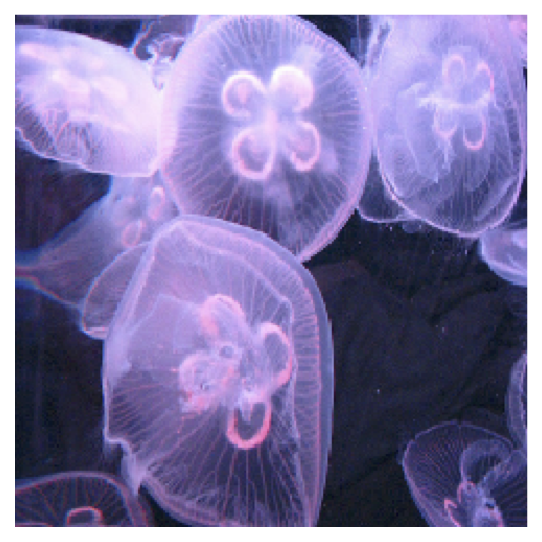
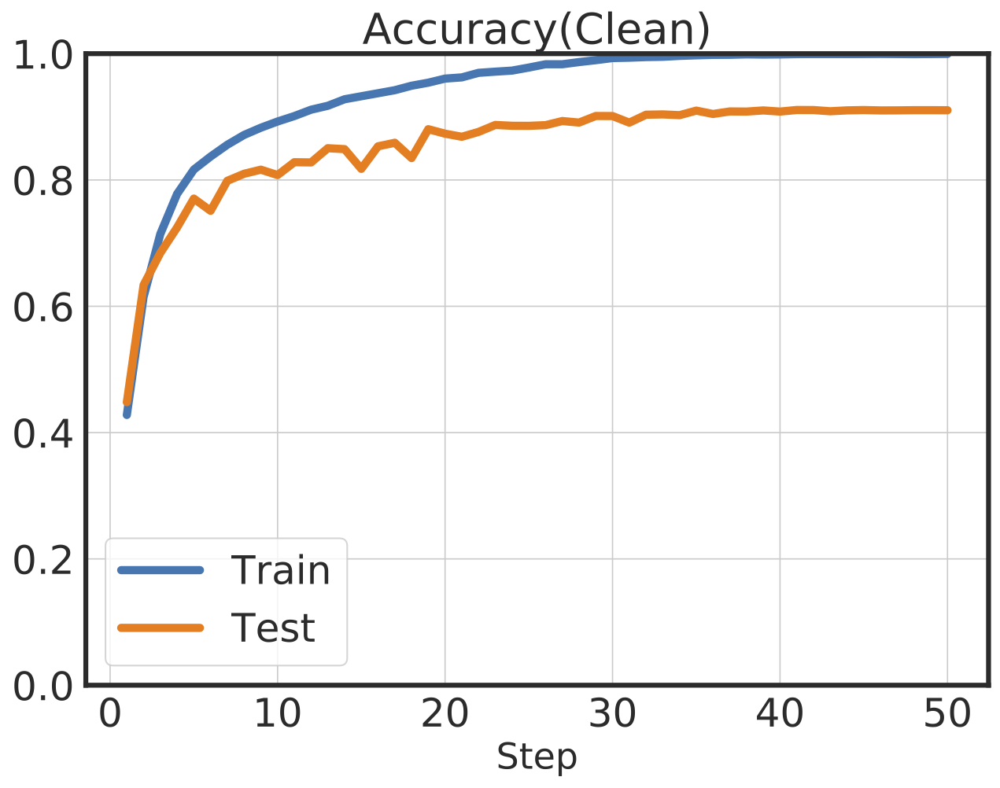
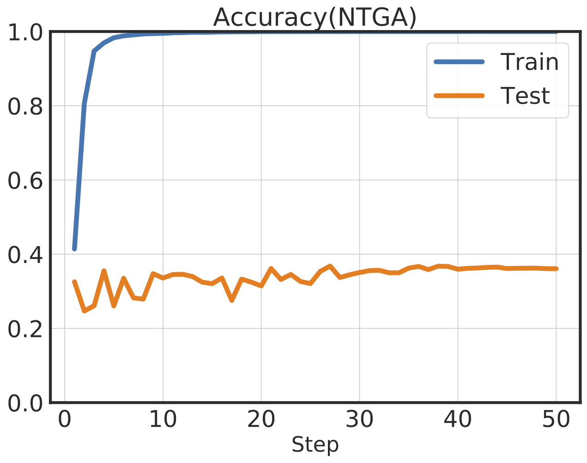
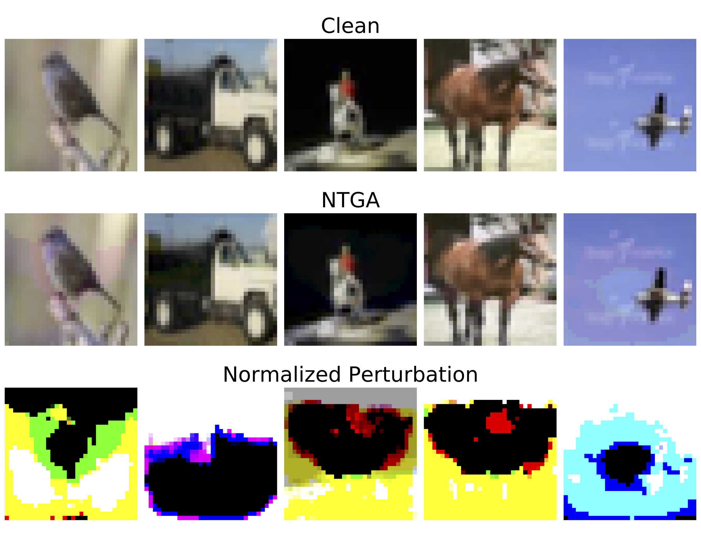
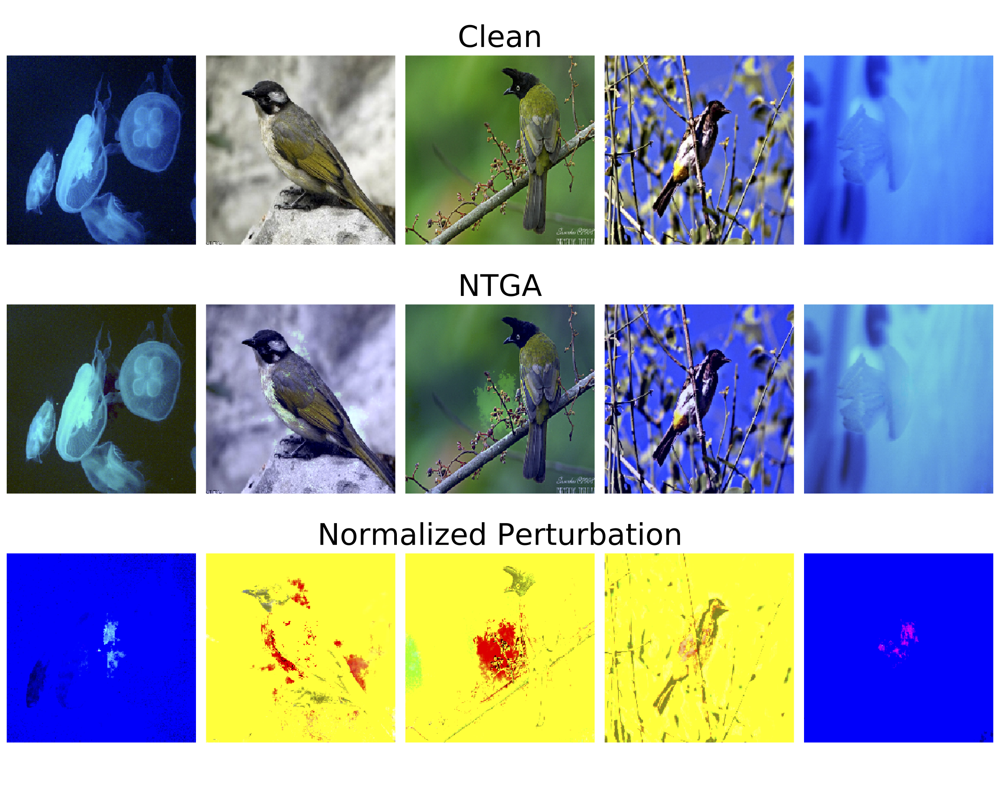

# Neural Tangent Generalization Attacks (NTGA)
<!-- [**ICML 2021 Video**](https://icml.cc/virtual/2021/spotlight/10216) -->
[**ICML 2021 Video**](https://recorder-v3.slideslive.com/?share=37793&s=8635f4a5-63b3-448e-af09-d44f3891d837)
| [**Paper**](http://proceedings.mlr.press/v139/yuan21b.html)
| [**Quickstart**](#installation)
| [**Results**](#results)
| [**Unlearnable Datasets**](#unlearnable-datasets)
| [**Competitions**](#competitions)
| [**Citation**](#citation)


[](https://github.com/lionelmessi6410/ntga/blob/main/LICENSE)

## Overview
This is the repo for [Neural Tangent Generalization Attacks](http://proceedings.mlr.press/v139/yuan21b.html), Chia-Hung Yuan and Shan-Hung Wu, In Proceedings of ICML 2021.

We propose the generalization attack, a new direction for poisoning attacks, where an attacker aims to modify training data in order to spoil the training process such that a trained network lacks generalizability. We devise Neural Tangent Generalization Attack (NTGA), a first efficient work enabling clean-label, black-box generalization attacks against Deep Neural Networks.

NTGA declines the generalization ability sharply, i.e. 99% -> 15%, 92% -> 33%, 99% -> 72% on MNIST, CIFAR10 and 2- class ImageNet, respectively. Please see [Results](#results) or the [main paper](http://proceedings.mlr.press/v139/yuan21b/yuan21b.pdf) for more complete results. We also release the *unlearnable* MNIST, CIFAR-10, and 2-class ImageNet generated by NTGA, which can be found and downloaded in [Unlearnable Datasets](#unlearnable-datasets), and also launch [learning on unlearnable data competitions](#competitions). The following figures show one clean and the corresponding poisoned examples.
<table class="center" border=0 width="50px">
	<thead>
		<tr>
			<th align="center" width="40%">Clean</th>
			<th align="center" width="40%">NTGA</th>
		</tr>
	</thead>
	<tbody>
		<tr>
			<td align="center" width="40%"></td>
			<td align="center" width="40%"></td>
		</tr>
	</tbody>
</table>

## Installation
Our code uses the [Neural Tangents](https://github.com/google/neural-tangents) library, which is built on top of [JAX](https://github.com/google/jax), and [TensorFlow 2.0](https://www.tensorflow.org/). To use JAX with GPU, please follow [JAX's](https://github.com/google/jax/#installation) GPU installation instructions. Otherwise, install JAX on CPU by running

```bash
pip install jax jaxlib --upgrade
```

Once JAX is installed, clone and install remaining requirements by running

```bash
git clone https://github.com/lionelmessi6410/ntga.git
cd ntga
pip install -r requirements.txt
```

If you only want to examine the effectiveness of NTGAs, you can download datasets [here](#unlearnable-datasets) and evaluate with `evaluate.py` or *any* code/model you prefer. To use `evaluate.py`, you do not need to install JAX externally, instead, all dependencies are specified in `requirements.txt`.

## Usage
### NTGA Attack
To generate poisoned data by NTGA, run

```bash
python generate_attack.py --model_type fnn --dataset cifar10 --save_path ./data/
```

There are few important arguments:
- `--model_type`: A string. Surrogate model used to craft poisoned data. One of `fnn` or `cnn`. `fnn` and `cnn` stands for the fully-connected and convolutional networks, respectively.
- `--dataset`: A string. One of `mnist`, `cifar10`, or `imagenet`. 
- `--t`: An integer. Time step used to craft poisoned data. Please refer to main paper for more details.
- `--eps`: A float. Strength of NTGA. The default settings for MNIST, CIFAR-10, and ImageNet are `0.3`, `8/255`, and `0.1`, respectively.
- `--nb_iter`: An integer. Number of iteration used to generate poisoned data.
- `--block_size`: An integer. Block size of B-NTGA algorithm.
- `--batch_size`: An integer.
- `--save_path`: A string.

In general, the attacks based on the FNN surrogate have greater influence against the fully-connected target networks, while the attacks based on the CNN surrogate work better against the convolutional target networks. The hyperparameter `t` plays an important role in NTGA, which controls when an attack will take effect during the training process of a target model. With a smaller `t`, the attack has a better chance to affect training before the early stop.

Both `eps` and `block_size` influence the effectiveness of NTGA. Larger `eps` leads to stronger but more distinguishable perturbations, while larger `block_size` results in better collaborative effect (stronger attack) in NTGA but also induces both higher time and space complexities. If you encounter out-of-memory (OOM) errors, especially when using `--model_type cnn`, please try to reduce `block_size` and `batch_size` to save memory usage.

For ImageNet or another custom dataset, please specify the path to the dataset in the code directly. The original clean data and the poisoned ones crafted by NTGA can be found and downloaded in [Unlearnable Datasets](#unlearnable-datasets).

### Evaluation
Next, you can examine the effectiveness of the poisoned data crafted by NTGA by calling

```bash
python evaluate.py --model_type densenet121 --dataset cifar10 --dtype NTGA \
	--x_train_path ./data/x_train_cifar10_ntga_cnn_best.npy \
	--y_train_path ./data/y_train_cifar10.npy \
	--batch_size 128 --save_path ./figure/
```

If you are interested in the performance on the clean data, run
```bash
python evaluate.py --model_type densenet121 --dataset cifar10 --dtype Clean \
	--batch_size 128 --save_path ./figures/
```

This code will also plot the learning curve and save it in `--save_path ./figures/`. The following figures show the results of [DenseNet121](https://arxiv.org/pdf/1608.06993.pdf) trained on the CIFAR-10 dataset. The left figure demonstrates the normal learning curve, where the network is trained on the clean data, and the test accuracy achieves \~93%. On the contrary, the figure on the right-hand side shows the remarkable result of NTGA, where the training accuracy is \~100%, but test accuracy drops sharply to \~37%, in other word, the model fails to generalize.

<table border=0>
	<tbody>
		<tr>
			<td width=50% ></td>
			<td width=50%></td>
		</tr>
	</tbody>
</table>

There are few important arguments:
- `--model_type`: A string. Target model used to evaluate poisoned data. One of `fnn`, `fnn_relu`, `cnn`, `resnet18`, `resnet34`, or `densenet121`.
- `--dataset`: A string. One of `mnist`, `cifar10`, or `imagenet`.
- `--dtype`: A string. One of `Clean` or `NTGA`, used for figure's title.
- `--x_train_path`: A string. Path for poisoned training data. Leave it empty for clean data (mnist or cifar10).
- `--y_train_path`: A string. Path for training labels. Leave it empty for clean data (mnist or cifar10).
- `--x_val_path`: A string. Path for validation data.
- `--y_val_path`: A string. Path for validation labels.
- `--x_test_path`: A string. Path for testing data. The ground truth (y_test) is hidden. You can submit the prediction to [Competitions](#competitions).
- `--epoch`: An integer.
- `--batch_size`: An integer.
- `--save_path`: A string.

### Visualization
How does the poisoned data look like? Is it truly imperceptible to a human? You can visualize the poisoned data and their normalized perturbations by calling

```bash
python plot_visualization.py --dataset cifar10 \
	--x_train_path ./data/x_train_cifar10.npy \
	--x_train_ntga_path ./data/x_train_cifar10_ntga_fnn_t1.npy \
	--save_path ./figure/
```

The following figure shows some poisoned CIFAR-10 images. As we can see, they look almost the same as the original clean data. However, training on the clean data can achieve \~92% test accuracy, while training on the poisoned data the performance decreases sharply to \~35%.
<p align="center">
	
</p>

Here we also visualize the high-resolution ImageNet dataset and find even more interesting results:
<p align="center">
	
</p>

The perturbations are nearly invisible. The only difference between the clean and poisoned images is the hue!

There are few important arguments:
- `--dataset`: A string. One of `mnist`, `cifar10`, or `imagenet`.
- `--x_train_path`: A string. Path for clean training data.
- `--x_train_ntga_path`: A string. Path for poisoned training data.
- `--num`: An integer. Number of data to be visualized. The valid value is 1-5.
- `--save_path`: A string.

## Results
Here we briefly report the performance of NTGA and two baselines (RFA and DeepConfuse) equipped with the FNN and CNN surrogates. NTGA(·) denotes an attack generated by NTGA with a hyperparameter `t` mentioned in [NTGA Attack](#ntga-attack), and NTGA(best) represents the results of the best hyperparameter of the specific dataset and surrogate combination. NTGA(1) is the most imperceptible poisoned data which has the lowest-frequency perturbations.

As we can see, NTGA attack has remarkable transferability across a wide range of models, including Fully-connected Networks (FNNs) and Convolutional Neural Networks (CNNs), trained under various conditions regarding the optimization method, loss function, etc.

### FNN Surrogate
<table border=0>
	<thead>
		<tr>
			<th align="left" width="160px">Target\Attack</th>
			<th align="center" width="160px">Clean</th>
			<th align="center" width="160px"><a href="https://www.mdpi.com/2504-4990/1/1/11/htm" target="_blank">RFA</a></th>
			<th align="center" width="160px"><a href="https://proceedings.neurips.cc/paper/2019/file/1ce83e5d4135b07c0b82afffbe2b3436-Paper.pdf" target="_blank">DeepConfuse</a></th>
			<th align="center" width="160px">NTGA(1)</th>
			<th align="center" width="160px">NTGA(best)</th>
		</tr>
	</thead>
	<tbody>
		<tr>
			<th align="left" colspan=6>Dataset: MNIST</th>
		</tr>
		<tr>
			<td align="left">FNN</td>
			<td align="center">96.26</td>
			<td align="center">74.23</td>
			<td align="center">-</td>
			<td align="center">3.95</td>
			<td align="center"><b>2.57</b></td>
		</tr>
		<tr>
			<td align="left">FNN-ReLU</td>
			<td align="center">97.87</td>
			<td align="center">84.62</td>
			<td align="center">-</td>
			<td align="center"><b>2.08</b></td>
			<td align="center">2.18</td>
		</tr>
		<tr>
			<td align="left">CNN</td>
			<td align="center">99.49</td>
			<td align="center">86.99</td>
			<td align="center">-</td>
			<td align="center">33.80</td>
			<td align="center"><b>26.03</b></td>
		</tr>
		<tr>
			<th align="left" colspan=6>Dataset: CIFAR-10</th>
		</tr>
		<tr>
			<td align="left">FNN</td>
			<td align="center">49.57</td>
			<td align="center">37.79</td>
			<td align="center">-</td>
			<td align="center">36.05</td>
			<td align="center"><b>20.63</b></td>
		</tr>
		<tr>
			<td align="left">FNN-ReLU</td>
			<td align="center">54.55</td>
			<td align="center">43.19</td>
			<td align="center">-</td>
			<td align="center">40.08</td>
			<td align="center"><b>25.95</b></td>
		</tr>
		<tr>
			<td align="left">CNN</td>
			<td align="center">78.12</td>
			<td align="center">74.71</td>
			<td align="center">-</td>
			<td align="center">48.46</td>
			<td align="center"><b>36.05</b></td>
		</tr>
		<tr>
			<td align="left">ResNet18</td>
			<td align="center">91.92</td>
			<td align="center">88.76</td>
			<td align="center">-</td>
			<td align="center">39.72</td>
			<td align="center"><b>39.68</b></td>
		</tr>
		<tr>
			<td align="left">DenseNet121</td>
			<td align="center">92.71</td>
			<td align="center">88.81</td>
			<td align="center">-</td>
			<td align="center"><b>46.50</b></td>
			<td align="center">47.36</td>
		</tr>
		<tr>
			<th align="left" colspan=6>Dataset: ImageNet</th>
		</tr>
		<tr>
			<td align="left">FNN</td>
			<td align="center">91.60</td>
			<td align="center">90.20</td>
			<td align="center">-</td>
			<td align="center"><b>76.60</b></td>
			<td align="center"><b>76.60</b></td>
		</tr>
		<tr>
			<td align="left">FNN-ReLU</td>
			<td align="center">92.20</td>
			<td align="center">89.60</td>
			<td align="center">-</td>
			<td align="center"><b>80.00</b></td>
			<td align="center"><b>80.00</b></td>
		</tr>
		<tr>
			<td align="left">CNN</td>
			<td align="center">96.00</td>
			<td align="center">95.80</td>
			<td align="center">-</td>
			<td align="center"><b>77.80</b></td>
			<td align="center"><b>77.80</b></td>
		</tr>
		<tr>
			<td align="left">ResNet18</td>
			<td align="center">99.80</td>
			<td align="center">98.20</td>
			<td align="center">-</td>
			<td align="center"><b>76.40</b></td>
			<td align="center"><b>76.40</b></td>
		</tr>
		<tr>
			<td align="left">DenseNet121</td>
			<td align="center">98.40</td>
			<td align="center">96.20</td>
			<td align="center">-</td>
			<td align="center"><b>72.80</b></td>
			<td align="center"><b>72.80</b></td>
		</tr>
	</tbody>
</table>

### CNN Surrogate
<table>
	<thead>
		<tr>
			<th align="left" width="160px">Target\Attack</th>
			<th align="center" width="160px">Clean</th>
			<th align="center" width="160px"><a href="https://www.mdpi.com/2504-4990/1/1/11/htm" target="_blank">RFA</a></th>
			<th align="center" width="160px"><a href="https://proceedings.neurips.cc/paper/2019/file/1ce83e5d4135b07c0b82afffbe2b3436-Paper.pdf" target="_blank">DeepConfuse</a></th>
			<th align="center" width="160px">NTGA(1)</th>
			<th align="center" width="160px">NTGA(best)</th>
		</tr>
	</thead>
	<tbody>
		<tr>
			<th align="left" colspan=6>Dataset: MNIST</th>
		</tr>
		<tr>
			<td align="left">FNN</td>
			<td align="center">96.26</td>
			<td align="center">69.95</td>
			<td align="center">15.48</td>
			<td align="center">8.46</td>
			<td align="center"><b>4.63</b></td>
		</tr>
		<tr>
			<td align="left">FNN-ReLU</td>
			<td align="center">97.87</td>
			<td align="center">84.15</td>
			<td align="center">17.50</td>
			<td align="center">3.48</td>
			<td align="center"><b>2.86</b></td>
		</tr>
		<tr>
			<td align="left">CNN</td>
			<td align="center">99.49</td>
			<td align="center">94.92</td>
			<td align="center">46.21</td>
			<td align="center">23.89</td>
			<td align="center"><b>15.64</b></td>
		</tr>
		<tr>
			<th align="left" colspan=6>Dataset: CIFAR-10</th>
		</tr>
		<tr>
			<td align="left">FNN</td>
			<td align="center">49.57</td>
			<td align="center">41.31</td>
			<td align="center">32.59</td>
			<td align="center">28.84</td>
			<td align="center"><b>28.81</b></td>
		</tr>
		<tr>
			<td align="left">FNN-ReLU</td>
			<td align="center">54.55</td>
			<td align="center">46.87</td>
			<td align="center">35.06</td>
			<td align="center">32.77</td>
			<td align="center"><b>32.11</b></td>
		</tr>
		<tr>
			<td align="left">CNN</td>
			<td align="center">78.12</td>
			<td align="center">73.80</td>
			<td align="center">44.84</td>
			<td align="center">41.17</td>
			<td align="center"><b>40.52</b></td>
		</tr>
		<tr>
			<td align="left">ResNet18</td>
			<td align="center">91.92</td>
			<td align="center">89.54</td>
			<td align="center">41.10</td>
			<td align="center">34.74</td>
			<td align="center"><b>33.29</b></td>
		</tr>
		<tr>
			<td align="left">DenseNet121</td>
			<td align="center">92.71</td>
			<td align="center">90.50</td>
			<td align="center">54.99</td>
			<td align="center">43.54</td>
			<td align="center"><b>37.79</b></td>
		</tr>
		<tr>
			<th align="left" colspan=6>Dataset: ImageNet</th>
		</tr>
		<tr>
			<td align="left">FNN</td>
			<td align="center">91.60</td>
			<td align="center">87.80</td>
			<td align="center">90.80</td>
			<td align="center"><b>75.80</b></td>
			<td align="center"><b>75.80</b></td>
		</tr>
		<tr>
			<td align="left">FNN-ReLU</td>
			<td align="center">92.20</td>
			<td align="center">87.60</td>
			<td align="center">91.00</td>
			<td align="center"><b>80.00</b></td>
			<td align="center"><b>80.00</b></td>
		</tr>
		<tr>
			<td align="left">CNN</td>
			<td align="center">96.00</td>
			<td align="center">94.40</td>
			<td align="center">93.00</td>
			<td align="center"><b>79.00</b></td>
			<td align="center"><b>79.00</b></td>
		</tr>
		<tr>
			<td align="left">ResNet18</td>
			<td align="center">99.80</td>
			<td align="center">96.00</td>
			<td align="center">92.80</td>
			<td align="center"><b>76.40</b></td>
			<td align="center"><b>76.40</b></td>
		</tr>
		<tr>
			<td align="left">DenseNet121</td>
			<td align="center">98.40</td>
			<td align="center">90.40</td>
			<td align="center">92.80</td>
			<td align="center"><b>80.60</b></td>
			<td align="center"><b>80.60</b></td>
		</tr>
	</tbody>
</table>

## Unlearnable Datasets
Here we publicly release the poisoned datasets generated by NTGA. We provide 5 versions for each dataset.
FNN(·) denotes an attack generated by NTGA from the FNN surrogate with a hyperparameter `t`. The *best* hyperparameter `t` is selected according to the empirical results. For the 2-class ImageNet, we choose `n01560419` and `n01910747` (bulbul v.s. jellyfish) from the original ImageNet dataset. Please refer to the [main paper](http://proceedings.mlr.press/v139/yuan21b/yuan21b.pdf) and [supplementary materials](http://proceedings.mlr.press/v139/yuan21b/yuan21b-supp.pdf) for more details.
- MNIST
	- FNN(best) = FNN(64)
	- CNN(best) = CNN(64)
- CIFAR-10
	- FNN(best) = FNN(4096)
	- CNN(best) = CNN(8)
- ImageNet
	- FNN(best) = FNN(1)
	- CNN(best) = CNN(1)

Please support the project by hitting a star if you find this code or dataset is helpful for your research.
<table>
	<thead>
		<tr>
			<th align="left" width="160px">Dataset\Attack</th>
			<th align="center" width="160px">Clean</th>
			<th align="center" width="160px">FNN(1)</th>
			<th align="center" width="160px">FNN(best)</th>
			<th align="center" width="160px">CNN(1)</th>
			<th align="center" width="160px">CNN(best)</th>
		</tr>
	</thead>
	<tbody>
		<tr>
			<td align="left">MNIST</td>
			<td align="center"><a href="https://drive.google.com/drive/folders/1Uh2k9HK6IlkZiFmDk_vi2Eq1m3VNgMyx?usp=sharing" target="_blank">Download</a></td>
			<td align="center"><a href="https://drive.google.com/drive/folders/1KRCz7_p8ls0pvCgbtFYdOE45z4pu-Jc0?usp=sharing" target="_blank">Download</a></td>
			<td align="center"><a href="https://drive.google.com/drive/folders/1IV5D0AjKxfbDE4R1tAM23S2Lfex6M68i?usp=sharing" target="_blank">Download</a></td>
			<td align="center"><a href="https://drive.google.com/drive/folders/1undk3SYXG_7-a0XuWHk_4otwUVgwegKr?usp=sharing" target="_blank">Download</a></td>
			<td align="center"><a href="https://drive.google.com/drive/folders/1On1bAnoraQy7gsSLX07pmuJAsb7M_hUC?usp=sharing" target="_blank">Download</a></td>
		</tr>
		<tr>
			<td align="left">CIFAR-10</td>
			<td align="center"><a href="https://drive.google.com/drive/folders/1NpXyJozirOSJ5bXBSeK7rtx9kBA6VttE?usp=sharing" target="_blank">Download</a></td>
			<td align="center"><a href="https://drive.google.com/drive/folders/1ThUWbImxykePScjHZy5lnQn5mNxG1x0U?usp=sharing" target="_blank">Download</a></td>
			<td align="center"><a href="https://drive.google.com/drive/folders/12JHBvsHroQ3awNedXV78ZVzVTqRbZ_Q_?usp=sharing" target="_blank">Download</a></td>
			<td align="center"><a href="https://drive.google.com/drive/folders/1PKA1BlNGROXyCuD3lt4bFe6Hvw1npELv?usp=sharing" target="_blank">Download</a></td>
			<td align="center"><a href="https://drive.google.com/drive/folders/1OD54_gK6wnhyVwQGnHs7vIsKVOL-48zd?usp=sharing" target="_blank">Download</a></td>
		</tr>
		<tr>
			<td align="left">ImageNet</td>
			<td align="center"><a href="https://drive.google.com/drive/folders/1vcqGiTrfIRAncyhhG5RvADt9-QCoEuEJ?usp=sharing" target="_blank">Download</a></td>
			<td align="center"><a href="https://drive.google.com/drive/folders/1I1qnppkdRCuGDLRd0ejDPjWPNSW_Bnrr?usp=sharing" target="_blank">Download</a></td>
			<td align="center"><a href="https://drive.google.com/drive/folders/1I1qnppkdRCuGDLRd0ejDPjWPNSW_Bnrr?usp=sharing" target="_blank">Download</a></td>
			<td align="center"><a href="https://drive.google.com/drive/folders/1_-C3P87aoUDfhMi8Nmz5PunKP3Z_SZbJ?usp=sharing" target="_blank">Download</a></td>
			<td align="center"><a href="https://drive.google.com/drive/folders/1_-C3P87aoUDfhMi8Nmz5PunKP3Z_SZbJ?usp=sharing" target="_blank">Download</a></td>
		</tr>
	</tbody>
</table>

We do not provide the test label (`y_test.npy`) for each dataset since we launched [Competitions](#competitions). Nevertheless, if you are a researcher and need to use these data for academic purpose, we are willing to provide the complete dataset to you. Please send an email to chyuan@datalab.cs.nthu.edu.tw. Last but not least, using these data to participate in the competition defeats the entire purpose. So seriously, don't do that.

## Competitions
We launch 3 competitions on Kaggle, where we are interested in learning from *unlearnable* MNIST, CIFAR-10, and 2-class ImageNet created by Neural Tangent Generalization Attack. Feel free to give it a shot if you are interested. We welcome people who can successfully train the model on the unlearnable data and overturn our conclusions.

<table>
	<tbody>
		<tr>
			<th align="left" width="160px">Kaggle Competitions</th>
			<td align="center" width="160px"><a href="https://www.kaggle.com/c/unlearnable-mnist" target="_blank">Unlearnable MNIST</a></td>
			<td align="center" width="160px"><a href="https://www.kaggle.com/c/unlearnable-cifar-10" target="_blank">Unlearnable CIFAR-10</a></td>
			<td align="center" width="160px"><a href="https://www.kaggle.com/c/unlearnable-imagenet" target="_blank">Unlearnable ImageNet</a></td>
		</tr>
	</tbody>
</table>

For instance, you can create a submission file by calling:
```bash
python evaluate.py --model_type resnet18 --dataset cifar10 --dtype NTGA \
	--x_train_path ./data/x_train_cifar10_unlearn.npy \
	--y_train_path ./data/y_train_cifar10.npy \
	--x_val_path ./data/x_val_cifar10.npy \
	--y_val_path ./data/y_val_cifar10.npy \
	--x_test_path ./data/x_test_cifar10.npy \
	--save_path ./figure/
```
The results will be stored as `y_pred_cifar10.csv`. Please specify `--x_test_path` for the test data.

## Citation
If you find this code or dataset is helpful for your research, please cite our [ICML 2021 paper](http://proceedings.mlr.press/v139/yuan21b/yuan21b.pdf).

```
@inproceedings{yuan2021neural,
	title={Neural Tangent Generalization Attacks},
	author={Yuan, Chia-Hung and Wu, Shan-Hung},
	booktitle={International Conference on Machine Learning},
	pages={12230--12240},
	year={2021},
	organization={PMLR}
}
```
